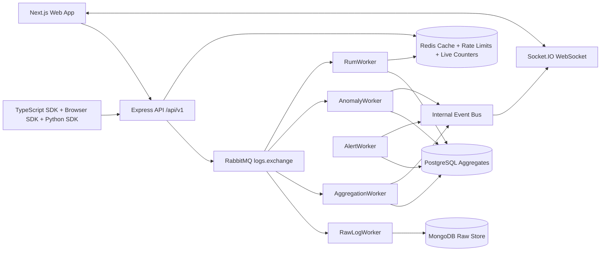
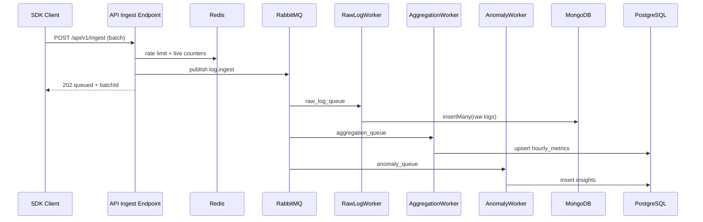

# PulseApi Architecture and Internal Working Guide

## 1. Document Purpose

This document describes the current architecture and internal working model of the PulseApi platform (ApexMonitor product surface), including:

- Monorepo structure
- Frontend architecture
- Backend architecture
- API flows and runtime behavior
- Data and queue topology
- SDK architecture and release model
- Local setup and environment model
- Future AI architecture direction

This is an implementation-level guide for engineers, maintainers, and future platform contributors.

---

## 2. Platform Overview

PulseApi is an observability platform with:

- Multi-project telemetry ingest
- Metrics/logs/traces analytics
- Browser RUM ingest and analysis
- Real-time dashboard updates over WebSocket
- Alerting and anomaly insights
- Multi-SDK developer integration surface

Core design principle:

- Async-first ingestion for throughput and resilience
- Query APIs over aggregated stores for dashboard speed
- Short-horizon live counters in Redis for low-latency live views

## 2.1 High-Level Architecture Diagram

---

## 3. Monorepo Architecture

Root is an npm workspace monorepo.

Top-level domains:

- apps/server: Express TypeScript backend
- apps/web: Next.js dashboard and product UI
- packages/sdk: TypeScript server/client SDK
- packages/browser-sdk: Browser-focused RUM SDK
- packages/python-sdk: Python SDK
- scripts: SQL migrations and operational scripts
- docs: architecture and operational docs

### 3.1 Runtime Boundaries

- Web app is a separate Next.js runtime.
- Server app exposes HTTP API and WebSocket channels.
- Background workers run inside server process bootstrap and consume RabbitMQ queues.
- Data services (MongoDB, PostgreSQL, Redis, RabbitMQ) are externalized infrastructure services (Docker for local).

---

## 4. Infrastructure Topology

Current local topology from docker-compose:

- MongoDB: raw log and raw RUM storage
- PostgreSQL: aggregated metrics, project/billing/config relational data
- Redis: rate limits, short-lived live counters, caching, HLL cardinality structures
- RabbitMQ: asynchronous fan-out ingest pipeline and DLQ support

### 4.1 Queue and Exchange Topology

RabbitMQ uses:

- Exchange: logs.exchange (direct)
- Exchange: dlq.exchange (direct)
- Queues: raw_log_queue, aggregation_queue, anomaly_queue, rum_queue
- DLQs: raw_log_dlq, aggregation_dlq, anomaly_dlq, rum_dlq

Routing behavior:

- log.ingest routes to raw_log_queue, aggregation_queue, anomaly_queue
- rum.ingest routes to rum_queue

This gives fan-out processing for one ingest event across persistence, aggregation, and anomaly pipelines.

---

## 5. Backend Architecture

Backend uses layered modules:

- Router layer: endpoint registration and middleware composition
- Controller layer: request validation and response shaping
- Service layer: business logic and orchestration
- Repository layer: data access and query isolation
- Worker layer: asynchronous batch processing
- Shared layer: constants, middleware, utilities, typed errors

### 5.1 Boot Process

At startup:

1. Environment is loaded and validated with Zod.
2. Mongo, PostgreSQL, Redis, RabbitMQ are connected in parallel.
3. Workers are started (raw log, aggregation, anomaly, RUM, alert loop).
4. Express app is created and mounted.
5. HTTP server is created and passed to WebSocket service.
6. Server listens on configured port.

### 5.2 HTTP Middleware Stack

Global middleware sequence:

- helmet
- cors (configured origins)
- compression
- express.json with payload limits
- request-id propagation middleware
- versioned API router mounted under /api/v1
- notFound handler
- global error handler

### 5.3 API Versioning

Current API namespace:

- /api/v1

Domain route groups:

- auth
- ingest
- rum
- metrics
- users
- billing
- projects
- logs
- insights
- keys
- traces

### 5.4 Error Handling Model

Current model combines:

- Domain error mapping in global error middleware
- Module-local direct status responses in some controllers

Canonical shape includes:

- error code
- message
- requestId
- optional details

Recommendation for long-term consistency:

- Move all module-local edge error writes toward centralized canonical response contracts.

---

## 6. Frontend Architecture

Frontend is Next.js App Router architecture with route groups:

- (marketing)
- (auth)
- (dashboard)

State and data model:

- Redux Toolkit for auth/persisted app state
- Redux Persist for token persistence
- React Query for remote data cache and fetch orchestration
- Axios apiClient with request and response interceptors

### 6.1 App Composition

Root layout:

- Sets metadata and global styles
- Wraps app with AppProviders

AppProviders stack:

- Redux Provider
- PersistGate
- RouteGate
- QueryProvider

Dashboard shell:

- Shared AppShell with nav, project switch, timeframe control, and profile actions

### 6.2 Frontend Auth Flow

Client auth behavior:

1. Access token attached in request interceptor.
2. On 401 (non-auth endpoint), refresh flow starts.
3. Concurrent requests queue while refresh is in progress.
4. New token resolves queue and failed requests replay.
5. Refresh failure clears auth state and redirects to login.

This produces a robust session continuation model for dashboard UX.

---

## 7. Data Flow and API Flow Narratives

## 7.0 Ingest Pipeline Sequence

## 7.1 User Auth Flow

1. Client calls /api/v1/auth/login or /api/v1/users/register.
2. Backend validates credentials and issues token pair.
3. Frontend stores tokens in Redux persisted state.
4. Protected routes use bearer token via apiClient interceptor.
5. Token refresh handled automatically on unauthorized response.

## 7.2 Log Ingest Flow (Server SDK path)

1. Producer sends batch to /api/v1/ingest.
2. IngestService performs project-tier-aware rate limit checks using Redis and PostgreSQL owner/subscription lookups.
3. Logs are normalized and privacy-safe transformed (endpoint normalization + IP hashing).
4. Batch published to RabbitMQ (logs.exchange, log.ingest).
5. Live counters are updated in Redis for real-time dashboard pulse.
6. API responds 202 queued with received and batchId.

Fan-out workers:

- RawLogWorker inserts raw logs in MongoDB.
- AggregationWorker computes hourly stats and upserts PostgreSQL hourly_metrics.
- AnomalyWorker computes z-score spikes and writes insights.

## 7.3 RUM Ingest Flow (Browser SDK path)

1. Browser client posts events to /api/v1/rum using RUM write key.
2. RumController validates media type, project key context, and batch payload schema.
3. RumService applies Redis-based rate limiting and idempotency lock.
4. Events are enriched with device/browser/os/geography/referrer/session hashes.
5. Enriched payload published to RabbitMQ (logs.exchange, rum.ingest).
6. API responds 202 queued.

RumWorker:

- Stores raw events in Mongo with duplicate-safe unordered inserts.
- Aggregates by hour and dimensions into PostgreSQL hourly_rum_metrics.
- Uses Redis HyperLogLog structures to estimate unique visitors and sessions.

## 7.4 Analytics Query Flow

1. Dashboard sends query with project/time parameters.
2. Controller validates query.
3. Service enforces project membership access.
4. Repository queries aggregated PostgreSQL tables.
5. Response returned as analytics payload for charts/cards.

## 7.5 Live Dashboard Flow (WebSocket)

1. Client opens socket and joins project room.
2. WebSocket service tracks active rooms.
3. Every 2s, service reads Redis live counters and top endpoint scores.
4. Service emits pulse:live payload to room.
5. Event bus anomaly events are merged into latestInsight in payload.

## 7.6 Alert Evaluation Flow

1. AlertWorker runs scheduled rule evaluation every 60s.
2. Pulls active rules and recent metrics from repository.
3. Calculates breach conditions (error rate / p99 latency).
4. Logs alert events and emits alert.triggered event.
5. Optional webhook dispatched for external notification channels.

---

## 8. SDK Architecture

The repository now contains three SDK packages.

## 8.1 TypeScript SDK (packages/sdk)

Role:

- Primary platform SDK with broad API coverage.

Internal structure:

- HttpClient transport core
- Auth strategy abstraction (bearer, apiKey, rumKey, custom)
- Retry/backoff and timeout handling
- Request-id and idempotency header support
- Typed ApexApiError and ApexNetworkError
- Domain clients (auth, projects, ingest, rum, metrics, logs, traces, insights, keys, billing)

## 8.2 Browser SDK (packages/browser-sdk)

Role:

- Browser-native RUM producer built on core SDK transport.

Internal behavior:

- Queue-based event buffering
- Flush interval and max queue threshold flush
- beforeunload flush best-effort behavior
- Event taxonomy for page_view, error, custom, web_vitals

## 8.3 Python SDK (packages/python-sdk)

Role:

- Python integration surface for server-side ingestion and analytics API consumers.

Internal behavior:

- requests-based HTTP client
- Retry/backoff model
- Auth header modes
- Idempotency-key support
- Endpoint convenience methods mirroring main platform surfaces

---

## 9. Internal Event-Driven Design

Internal event bus currently supports:

- aggregation.completed
- anomaly.detected
- alert.triggered

Pattern value:

- Decouples worker outputs from websocket and downstream response side effects.
- Enables future analytics and AI consumers without tightly coupling worker logic.

---

## 10. Local Setup and Environment

## 10.1 Local prerequisites

- Node.js for apps and JS SDK workspaces
- Python for Python SDK package build
- Docker for local infra dependencies

## 10.2 Local infra startup

1. docker compose up -d
2. Confirm services:
- Mongo on 27018
- Postgres on 9999
- Redis on 6379
- RabbitMQ on 5672 and management on 15672

## 10.3 Environment variables

Server validates env at boot with Zod. Mandatory variables include:

- MONGO_URI
- PG_URI
- REDIS_URL
- RABBITMQ_URL
- JWT_SECRET
- ARGON2_PEPPER
- CORS_ORIGINS

## 10.4 App start

From repo root:

- npm run dev:server
- npm run dev:web

---

## 11. Security and Reliability Notes

Current strengths:

- Request-id propagation for traceability
- Token refresh queue strategy in frontend client
- Payload size protection for JSON body parser
- Queue DLQ topology for worker failure isolation
- IP hashing for privacy-preserving log ingestion
- RUM idempotency and anti-replay guard window

Hardening opportunities:

- Normalize all response envelopes and error shapes
- Add universal idempotency for non-RUM mutation endpoints
- Enforce standard rate-limit headers
- Add explicit API deprecation headers and compatibility policy
- Add OTel span emission in API + workers

---

## 12. Current Repository Structure (Conceptual)

- apps/
- apps/server/
- apps/server/src/
- apps/server/src/modules/
- apps/server/src/workers/
- apps/server/src/infrastructure/
- apps/web/
- apps/web/app/
- apps/web/features/
- apps/web/shared/
- packages/
- packages/sdk/
- packages/browser-sdk/
- packages/python-sdk/
- scripts/
- docs/

---

## 13. Build, Release, and SDK Publishing

Publishing targets:

- npm: @apexmonitor/sdk
- npm: @apexmonitor/browser-sdk
- PyPI: apexmonitor-sdk

Release pipeline:

- GitHub Actions workflow supports build and publish for npm and PyPI.
- Tokens required in CI secrets:
- NPM_TOKEN
- PYPI_API_TOKEN

Manual and CI release checklist is documented in docs/sdk-publishing.md.

---

## 14. AI Architecture Direction (Future)

Current anomaly detection is statistical (z-score) and rule-driven. AI roadmap can evolve this into a layered intelligence plane.

## 14.1 Proposed AI Layers

1. Detection Layer
- Multivariate anomaly detection over latency, error-rate, throughput, and RUM vitals.
- Seasonal and trend-aware models by endpoint and project.

2. Correlation Layer
- Cross-signal incident correlation between logs, traces, metrics, and RUM anomalies.
- Root-cause candidate scoring and confidence output.

3. Recommendation Layer
- Automated remediation suggestions from known incident patterns.
- Alert tuning recommendations (threshold and window updates).

4. Natural Language Layer
- Incident summaries and query assistant for operators.
- Human-readable explanations tied to source evidence and requestId traces.

## 14.2 AI Data Plane Requirements

- Feature store tables for historical endpoint behavior.
- Model inference service (async/non-blocking) fed by worker events.
- Feedback loops from operator actions for model quality scoring.
- Strong tenant isolation for features and model context.

## 14.3 AI Safety and Governance

- Confidence thresholds with fallback to deterministic rules.
- Explainability payloads attached to insight records.
- Cost controls (sampling, model tiering, batch inference windows).
- Audit logs for AI decision outputs and operator overrides.

---

## 15. Engineering Priorities for Next Iteration

1. Contract-first OpenAPI source of truth and generated SDK typing.
2. Unified API envelope and pagination conventions.
3. Cross-SDK conformance test suite against running backend.
4. Production-ready auth model for websocket room authorization.
5. OTel instrumentation and SLO dashboards for API and workers.
6. AI pilot on latency anomaly explainability before broad rollout.

---

## 16. Primary Source Files for This Guide

Backend core:

- apps/server/src/bootstrap.ts
- apps/server/src/app.ts
- apps/server/src/config/config.ts
- apps/server/src/shared/constants/endpoints.ts
- apps/server/src/shared/middleware/error-handler.ts
- apps/server/src/modules/ingest/ingest.service.ts
- apps/server/src/modules/rum/rum.service.ts
- apps/server/src/modules/websocket/websocket.service.ts
- apps/server/src/workers/raw-log.worker.ts
- apps/server/src/workers/aggregation.worker.ts
- apps/server/src/workers/anomaly.worker.ts
- apps/server/src/workers/rum.worker.ts
- apps/server/src/workers/alert.worker.ts

Frontend core:

- apps/web/app/layout.tsx
- apps/web/app/(dashboard)/layout.tsx
- apps/web/app/providers/AppProviders.tsx
- apps/web/app/providers/QueryProvider.tsx
- apps/web/shared/api/apiClient.ts
- apps/web/shared/api/endpoints.ts
- apps/web/shared/layout/AppShell.tsx

SDK and release:

- packages/sdk/src/http.ts
- packages/sdk/src/client.ts
- packages/browser-sdk/src/index.ts
- packages/python-sdk/src/apexmonitor_sdk/client.py
- .github/workflows/release-sdks.yml
- docs/sdk-publishing.md
